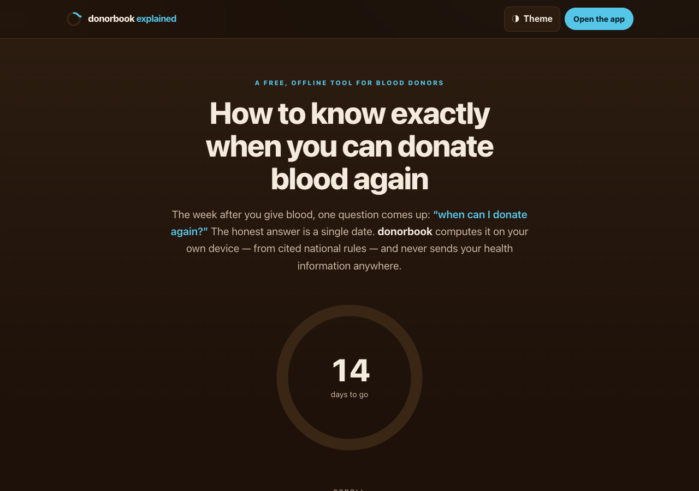

# donorbook explained

**An animated explainer of [donorbook](https://sreenivas-sadhu-prabhakara.github.io/donorbook/)** — the free, offline tool that tells you exactly when you can donate blood again. This is a single-page, scroll-driven walkthrough of the idea: the problem, how the calculation works, why every verdict is cited, and how the browser itself enforces the privacy guarantee.

## What this is

This repository is **not** the app — it is a standalone page that *explains* it. It uses only CSS and inline SVG for its animation (no libraries), respects `prefers-reduced-motion`, and is fully legible with JavaScript disabled. If you just want to compute your next donation date, go straight to the app:

**→ [Open donorbook](https://sreenivas-sadhu-prabhakara.github.io/donorbook/)**

## Why an explainer

The question *"when can I donate blood again?"* has a simple answer — your last donation plus your country's published interval — but most of the web wraps it in vague blog posts or lead-generation forms. donorbook answers it honestly and privately, and this page walks through exactly how, so the idea is clear before you ever open the tool.

## What it covers

1. **The hook** — one exact date, computed on your device.
2. **The real problem** — why searching for the answer usually fails.
3. **How it works** — last donation + one cited interval → a next-eligible date, shown on the *eligibility ring* (the shared visual motif).
4. **Cited rules** — every verdict shows the exact rule from NBTC India, the American Red Cross or UK NHSBT, with a source link and last-verified date; medication questions always resolve to *ask the blood bank*.
5. **Privacy you can verify** — how `connect-src 'none'` makes the browser physically block any send.
6. **A feature tour** — the five things donorbook does, all on-device.
7. **A call to action** — open the app.

## Quickstart

Just open `index.html` in any modern browser — no build step, no server, no install.

- **Local:** double-click `index.html`, or run a static server in the folder.
- **Hosted:** **[Open this explainer live](https://sreenivas-sadhu-prabhakara.github.io/donorbook-explained/)**

## Built the same way as the app

- **Zero dependencies.** Plain HTML, one CSS file, one small vanilla-JS controller.
- **Strict Content-Security-Policy** with `connect-src 'none'` — no fonts, scripts, images or analytics from any other origin. Nothing this page does touches the network.
- **Accessible.** WCAG-AA contrast in both light and dark schemes, a skip link, keyboard-operable controls, visible focus rings, and a reduced-motion path that shows every animation's final state statically.
- **Same visual family as donorbook** — the warm crema/espresso palette, the sky-cyan eligibility ring, carried through the page, the OG card and the icon.

## Privacy

This is an explainer page, so it stores almost nothing — only your light/dark theme preference in `localStorage`. A strict `connect-src 'none'` policy means the page cannot make any network request. There is no tracking, no analytics, and no external assets.

## Disclaimer

This page describes **donorbook**, which is **not medical advice**. donorbook is a *pre-check* built from the published general eligibility criteria of three named authorities (NBTC India, American Red Cross, UK NHSBT); the intervals mentioned here were last verified **2026-07-22**. It **never confirms eligibility** — the blood bank's on-site screening always decides. Rules change over time and individual blood banks differ; medication and detailed medical-history questions are never computed. This software is provided under the MIT License, "as is", without warranty of any kind; the authors accept no liability for any loss, injury, or damage arising from its use.

## License

[MIT](./LICENSE) © 2026 Sreenivas Sadhu Prabhakara
